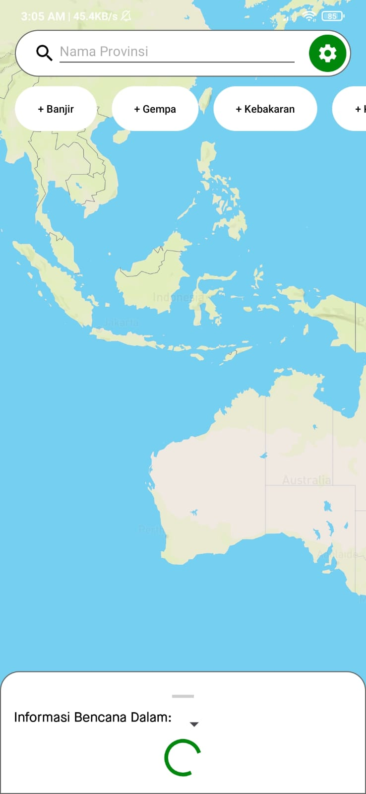

# Gihsaster

Gihsaster is an Android application that helps users to monitor various natural disasters occurring
in Indonesia, such as floods, earthquakes, fires, haze, strong winds, and volcanic activities. This
application offers real-time information on these disasters, keeping users well-informed with
up-to-date data.

## Features

- List disaster in 7 days
- Show disasters on map
- Support light/dark theme
- Animation Loading
- Use Dependencies Injection with Dagger-Hilt
- SOID from SOLID principle

## Built With

1. Kotlin
2. Mapbox
3. Retrofit2
4. Dagger-Hilt
5. MVVM architecture
6. Shared Preferences
7. Coroutine

## Installation

**Clone Project**

1. Clone this Project by running the following command in your terminal or Git command prompt:

```bash
  git clone https://github.com/GG-3-0-Mobile-Engineering/ME14-DisasterApp-GG3MEGP0554-GiovanniDeLeandro.git
```

2. Open the project in Android Studio (preferably Android Studio Flamingo | 2022.2.1 Patch 2).

3. Run the app on your phone or virtual device.

**APK Installation**

Google Drive:

```bash
  https://drive.google.com/file/d/1368aru0TI0sI9-6_WHe-2gUnfv0YgaHN/view?usp=drive_link
```

## Screenshots

       
       

## Demo

https://youtube.com/shorts/qm6x5J5UYGc?feature=share